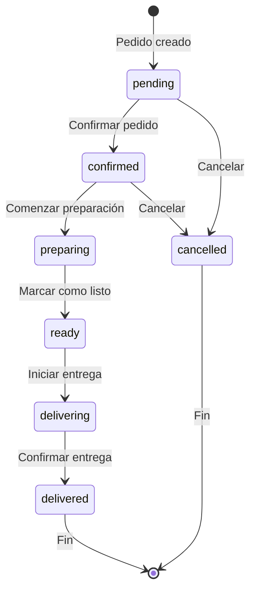

# UberEatsApp – Documentación del Proyecto   

Gutierrez Cepeda Andres 23211009
patrones de diseno 
maetra: MARIBEL GUERRERO LUIS


## Descripción General
UberEatsApp es una aplicación web de pedidos de comida a domicilio, desarrollada con Next.js, React y TypeScript. Permite a los usuarios explorar restaurantes, ver menús, agregar productos al carrito y realizar pedidos, siguiendo el ciclo de vida de un pedido con diferentes estados.

---

## Tecnologías Utilizadas
- **Visual Studio Code** (editor de código)
- **Next.js** (framework de React)
- **React** (UI basada en componentes)
- **TypeScript** (tipado estático)
- **pnpm** (gestor de paquetes)
- **CSS Modules** y archivos CSS (estilos)
- **Lucide React** (iconos)
- **Git y GitHub** (control de versiones)

---

## Estructura del Proyecto
- `/components/` – Componentes visuales reutilizables (tarjetas, menús, header, etc.)
- `/hooks/` – Hooks personalizados para lógica de negocio y estado
- `/lib/` – Lógica de negocio, modelos de datos y utilidades
- `/app/` – Páginas principales y layout de la aplicación
- `/public/` – Recursos estáticos (imágenes, íconos)
- `/styles/` – Archivos CSS globales

---

## Patrón de Diseño Principal
**Patrón Estado (State Pattern):**
- Implementado en `lib/order-state.ts`.
- Cada estado del pedido (pendiente, confirmado, preparando, listo, en camino, entregado, cancelado) es una clase independiente.
- Permite cambiar el comportamiento del pedido según su estado interno.

---

## Componentización
- Cada parte visual está separada en componentes (`restaurant-card.tsx`, `menu-item-card.tsx`, `cart-drawer.tsx`, etc.).
- Los componentes reciben datos (nombre, precio, imagen) y los muestran en la interfaz.

---

## Datos y Modelos
- Los productos, precios e imágenes están definidos en `lib/sample-data.ts` y en las interfaces `MenuItem` y `CartItem` de `lib/order-state.ts`.
- Los pedidos usan la interfaz `Order`.

---

## Hooks Personalizados
- Ejemplo: `useOrder` para manejar el estado del pedido.
- Encapsulan lógica reutilizable para los componentes.

---

## Gestión de Temas
- El archivo `components/theme-provider.tsx` permite cambiar el tema visual de la app.

---

## Diagrama de Estados del Pedido


---

## Ejemplo de Flujo de Pedido
1. El usuario selecciona productos y realiza un pedido.
2. El pedido inicia en estado "pending".
3. El restaurante confirma y el pedido pasa a "confirmed".
4. Se prepara, se marca como listo, se entrega y finalmente se marca como "delivered".
5. En cualquier momento inicial, el pedido puede ser "cancelled".

---

## Cómo ejecutar el proyecto
1. Instala dependencias:
   ```sh
   pnpm install
   ```
2. Inicia el servidor de desarrollo:
   ```sh
   pnpm run dev
   ```
3. Abre [http://localhost:3000](http://localhost:3000) en tu navegador.

---

## Capturas


---

## Licencia
Este proyecto es solo para fines educativos.
